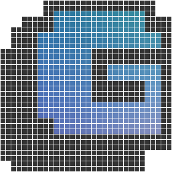

# Gamma



### A simple ECS game engine for Python, built on Pygame, with an emphasis on ease of use.

## Installing

```
python3 setup.py install
```

Note: This library is currently in early development. Until it reaches version 1.0 it will change a lot, including the introduction of some breaking changes.

Until the library is more stable, it's advised to install using `python3 setup.py develop` in a virtual environment. This means that changes made to the library won't require a reinstall. Just `git pull` to get the latest version.

The following commands create an overall place (specified by `folder-name`) in which to work. A virtual environment is then created in the root of that folder, with separate sub-folders `gamma` for the game engine and `game-folder-name` for the game that you'll create. This ensures that everything is in the same virtual environment, but separating the engine from the game being developed. This will allow you to upload the game you make to a separate git repository.

```
pip3 install virtualenv
mkdir [folder-name]
cd [folder-name]

virtualenv venv
source venv/bin/activate

git clone https://github.com/rik-cross/gamma.git
cd gamma

python3 setup.py develop
cd ..

mkdir [game-folder-name]
cd [game-folder-name]
```

## Getting started

+ See the [examples](./examples/)
+ Follow the 'Collect the Coins' [tutorial video series](https://www.youtube.com/playlist?list=PLQaniv5ve2ygtBCpEiLC_fFa0Um-51Txu) and [final code](./examples/collect_the_coins)

## Changelog

|Version|Description|
|---|---|
|0.1|Initial engine version. Includes a basic ECS implementation, scenes (and transitions) and some UI elements. There are very basic versions of a number of systems.|
|0.2|Some improvements to the systems, mainly adding optional parameters to allow customisation.|
|0.3|More improvements to the systems, including the addition of a renderer for each scene. This takes the drawing away from the camera system, and allows for the addition of custom systems that can draw.|
|0.4|The addition of a 'collect the coins' example, showing how to create a very simple but complete game. This coincides with the creation of an initial video tutorial series. There are also other various edits and improvements.|

## Licence

Distributed under the MIT License. See [LICENSE](LICENSE) for more information.
